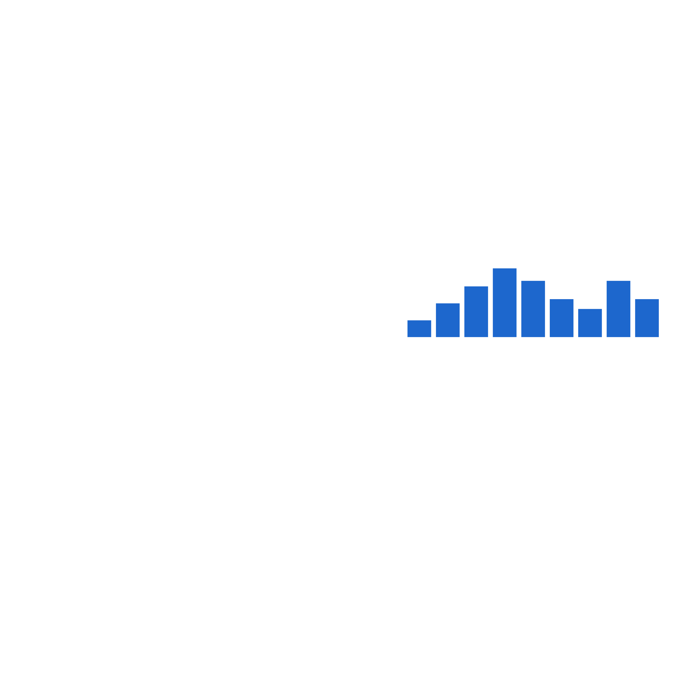

<p align="center">
  
</p>

<h1 align="center">OOC Radio for FH6</h1>

<p align="center">
  An in-game-only <a href="https://en.wikipedia.org/wiki/Forza_Horizon_6">Forza Horizon 6</a> radio mod that streams
  <a href="https://radio.oocradio.com/">Out of Character Radio</a> straight onto the radio dial.
</p>

<p align="center">
  <a href="LICENSE"></a>
  
</p>

---

## What it does

OOC Radio for FH6 adds a single new radio station to Forza Horizon 6, fed by
the OOC Radio stream. It plugs into the game the same way every other
station does: it ducks for menus, follows your in-game volume slider, and
fades on loading screens. Track title/artist/album art come from OOC Radio's
own metadata API rather than plain stream tags, and when a presenter is live
on air, the dial's artist line and artwork switch to show who it is.

There is **no web dashboard** and no other audio sources bolted on — this is
a single-purpose mod. Everything is configured by hand-editing one
`config.toml`.

## Features

- Streams the OOC Radio direct feed straight into FH6's radio bus.
- Real now-playing metadata (title / artist / album / art) from OOC Radio's
  authenticated API, not just raw stream tags.
- Live presenter detection — the dial shows who's on air, in real time.
- Race-start action, loudness normalization, and a 5-band equalizer.
- No dashboard, no background web server, no other sources — nothing
  running beyond what's needed to play one station.

## Install

1. **Get an API key.** Open <https://radio.oocradio.com/>, go to
   **Developer**, and create a key (looks like `oocr_live_...`).
2. **Download the latest release** from the
   [Releases](https://github.com/tommy141x/fh6-ooc-radio/releases) page.
3. **Close Forza Horizon 6** if it's running, then extract the ZIP directly
   into the folder that contains `forzahorizon6.exe`. Typical locations:
   ```
   Steam    ...\steamapps\common\ForzaHorizon6
   Xbox app ...\XboxGames\Forza Horizon 6\Content
   ```
4. **Set your API key.** Open `fh6-radio\config.toml` (now sitting next to
   `version.dll`) in any text editor and paste your key in:
   ```toml
   [ooc_radio]
   enabled = true
   api_key = 'oocr_live_YOUR_KEY_HERE'
   ```
5. **Launch the game.** Go to **Settings → Audio** and set:
   - **Radio DJ** → `Off` (otherwise the in-game DJ talks over tracks)
   - **Streamer Mode** → `On` (the new station only appears with this on —
     it's how FH6 exposes a station slot that's safe for a mod to control)
6. **Cycle radio stations** in-game until you land on the new one. Audio
   only plays while that station is selected.

If Windows Defender or another antivirus flags `version.dll`, that's a
false positive from how the mod hooks into the game process — add an
exclusion for the game folder.

## Uninstall

Delete `version.dll` and the `fh6-radio\` folder from the game directory.
Nothing else was touched, so no repair/verify step is required (though
running one won't hurt).

## Build from source

Requires **Visual Studio 2022+** with the *Desktop development with C++*
workload (Windows), or **CMake + llvm-mingw** for a Linux cross-build.

```powershell
.\scripts\get-deps.ps1                                                  # one-time: fetch header-only deps
.\scripts\build.ps1                                                     # compile + stage dist\
.\scripts\install.ps1 -GameDir "C:\XboxGames\Forza Horizon 6\Content"    # copy into game
```

```bash
./scripts/get-deps.sh                                                   # one-time: fetch header-only deps
./scripts/build.sh                                                      # compile + stage dist/
./scripts/install.sh ~/.steam/steam/steamapps/common/ForzaHorizon6      # copy into game (Proton prefix)
```

## Why this exists

This is a stripped-down, single-purpose fork of
[g0ldyy/fh6-universal-radio](https://github.com/g0ldyy/fh6-universal-radio) —
all credit for the underlying game-hooking work (the `version.dll` proxy,
FMOD audio hook, and in-game texture injection) belongs there. This fork
removes every other audio source and the web dashboard, and replaces them
with one hardcoded OOC Radio integration. See [NOTICE](NOTICE) for the full
attribution chain.

## License

GPLv3 — see [LICENSE](LICENSE). Forks and derivatives must remain GPLv3 and
carry forward the attribution in [NOTICE](NOTICE).

## Disclaimer

Unofficial fan-made mod. Not affiliated with, endorsed by, or connected to
Turn 10 Studios, Playground Games, Xbox Game Studios, Microsoft, or OOC
Radio. All trademarks belong to their respective owners. Use at your own
risk.
